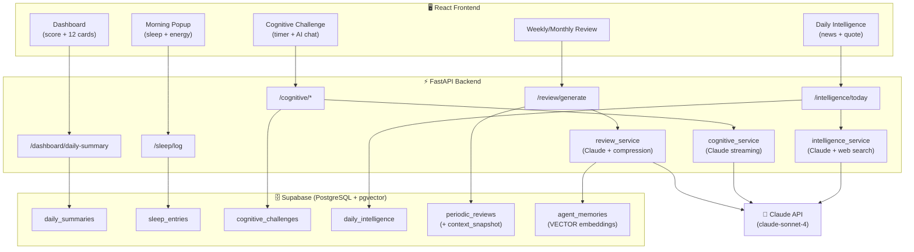

# 🏗️ ARCHITECTURE.md — Life OS v2

## System Overview

Life OS is a personal intelligence platform for a single user. It collects data across 12 life domains, stores it in Supabase (PostgreSQL + pgvector), compresses historical context into agent-friendly snapshots, and uses Claude-powered AI agents to score, analyze, and plan each day.

---

## System Diagram

```
┌────────────────────────────────────────────────────────────────────────┐
│                            LIFE OS PLATFORM                            │
│                                                                        │
│  ┌──────────────────────────────────────────────────┐                 │
│  │              React Frontend (Vite + TS)           │                 │
│  │  Dashboard │ 12 Module Pages │ Morning Popup      │                 │
│  │  Cognitive Timer │ AI Chat │ Reviews │ Streaks    │                 │
│  └──────────────────────┬───────────────────────────┘                 │
│                         │ REST API                                     │
│  ┌──────────────────────▼───────────────────────────┐                 │
│  │              FastAPI Backend (Python 3.12)        │                 │
│  │  12 Domain Routers │ Services │ Agent Orchestr.  │                 │
│  └────┬──────────┬────────────┬───────────┬─────────┘                 │
│       │          │            │           │                            │
│  ┌────▼────┐ ┌───▼────┐  ┌───▼──────┐ ┌──▼──────────────┐            │
│  │Supabase │ │Claude  │  │Web Search│ │ External APIs   │            │
│  │Postgres │ │API     │  │(via      │ │ (future)        │            │
│  │+pgvector│ │Agents  │  │ Claude)  │ │ Google Calendar │            │
│  └─────────┘ └────────┘  └──────────┘ │ Health Connect  │            │
│                                        └─────────────────┘            │
└────────────────────────────────────────────────────────────────────────┘
```

---

## Module Architecture Map



---

## The 12 Modules

| # | Module | Data Table | AI Usage | Status |
|---|---|---|---|---|
| 1 | Daily Goals | `goals` | Agent scoring | ⬜ Module 2 |
| 2 | Sleep & Energy | `sleep_entries` | Morning popup (manual) | 🔄 Module 1 |
| 3 | Supplement Routine | `supplement_items`, `supplement_logs` | Agent scoring | ⬜ Module 3 |
| 4 | Strength & Cardio | `workout_sessions` | Agent scoring | ⬜ Module 4 |
| 5 | Cognitive Challenge | `cognitive_challenges` | Socratic tutor (streaming) | 🔄 Module 1 |
| 6 | Mental Health | `mental_health_logs` | AI conversation + embedding | ⬜ Module 5 |
| 7 | Body Metrics | `body_metrics` | Trend analysis | ⬜ Module 3 |
| 8 | Nutrition | `nutrition_logs` | Summary + suggestions | ⬜ Module 4 |
| 9 | Deep Work | `deep_work_sessions` | Productivity scoring | ⬜ Module 3 |
| 10 | Learning | `learning_logs` | Comprehension quiz gen | ⬜ Module 4 |
| 11 | Daily Intelligence | `daily_intelligence` | Claude + web search | 🔄 Module 1 |
| 12 | Weekly/Monthly Review | `periodic_reviews` | Full agent analysis + compression | 🔄 Module 1 |

---

## Context Compression Architecture

This is the core memory management strategy that keeps AI agent context windows clean:

```
RAW DATA (grows daily)
    ↓
7 days: full raw data  →  fed directly to agents
    ↓
Weekly Review (every 7 days)
    ↓
  ┌─────────────────────────────────┐
  │  Full Review Markdown (~2000t)  │  → stored, shown to user
  │  Context Snapshot (<400t JSON)  │  → fed to agents
  └─────────────────────────────────┘
    ↓
Monthly Review (every 30 days)
    ↓
  ┌─────────────────────────────────┐
  │  Full Review Markdown (~3000t)  │  → stored, shown to user
  │  Context Snapshot (<400t JSON)  │  → fed to agents
  └─────────────────────────────────┘

AGENT CONTEXT ASSEMBLY:
  └── 7 days raw data (full)
  └── 12 weekly snapshots (~4800t total)
  └── 6 monthly snapshots (~2400t total)
  └── User profile + long-term memories
  ≈ ~8000 tokens total → agents always have rich context without overload
```

---

## Key Data Flows

### Morning Startup Flow
```
User opens app (first time today)
  → Frontend checks localStorage: lifeos_morning_{date}
  → Not found → Morning Popup appears
  → User fills: sleep hrs, quality stars, energy slider, mood emoji
  → POST /api/v1/sleep/log
  → FastAPI upserts sleep_entries
  → localStorage flag set
  → Popup closes → Dashboard renders
```

### Cognitive Challenge Flow
```
User clicks "Cognitive Challenge" card
  → GET /api/v1/cognitive/today
  → Page shows: title, difficulty, "Open Challenge" link
  → User clicks "Start Timer"
  → Frontend saves { startedAt: timestamp, duration: 1800 } to localStorage
  → SVG ring counts down
  → Timer expires OR user clicks "I need help"
  → AI chat panel slides in
  → User asks question
  → POST /api/v1/cognitive/explain (streaming)
  → FastAPI streams Claude Socratic response
  → User marks complete
  → POST /api/v1/cognitive/complete
```

### Daily Intelligence Flow
```
User opens /intelligence
  → GET /api/v1/intelligence/today
  → FastAPI checks daily_intelligence table for today's date
  → If exists → return cached data
  → If not → call Claude API with web search enabled
  → Claude returns { news: [...], quote, quote_author }
  → Save to daily_intelligence table
  → Return to frontend
  → Render 3 news cards + quote card
```

### Review + Compression Flow
```
User clicks "Generate Weekly Review"
  → POST /api/v1/review/generate?type=weekly
  → FastAPI fetches 7 days of data from all 12 module tables
  → Call Claude: generate full markdown review
  → Call Claude again: compress to <400 token JSON snapshot
  → Save both to periodic_reviews table
  → Return review to frontend
  → Frontend renders markdown + shows "Context compressed ✓" badge
```

---

## Module Build Roadmap

| Phase | Modules | Key Features |
|---|---|---|
| **Module 1** (now) | Dashboard + Sleep popup + Cognitive + Intelligence + Review | Foundation, timer, AI chat, compression |
| **Module 2** | Goals + Google Calendar sync | OAuth2, calendar events as goals |
| **Module 3** | Supplements + Body Metrics + Deep Work | Checklists, body tracking, focus timer |
| **Module 4** | Workout + Nutrition + Learning | Muscle viz, meal log, quiz generation |
| **Module 5** | Mental Health + AI conversation | Mood tracking, journal embeddings, AI therapist |
| **Module 6** | AI Agent Orchestration | LangGraph, daily scoring agent, planning agent |
| **Module 7** | Full Reports + Streak Engine | Analytics, trends, gamification |
